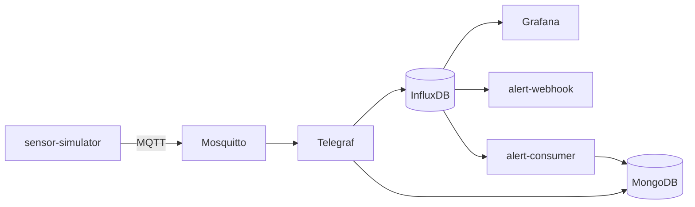

# SmartFarm

<p>
  
  
  
  
  
  
  
</p>

A real-time **data stream pipeline** for a smart farm. Simulated IoT sensors publish
readings over MQTT; the pipeline stores them, detects anomalies inside the database, and
visualizes everything on interactive dashboards. The whole stack runs in Docker and starts
with a single command.

## Architecture



The simulator publishes one JSON payload per reading to a dedicated MQTT topic. The broker
decouples producer and consumers. Telegraf subscribes to the topics and writes **raw data**
to InfluxDB (real-time storage) and **aggregates** to MongoDB (permanent history). Inside
InfluxDB, Flux tasks continuously evaluate thresholds and write **alert events** to a
dedicated bucket; from there a consumer persists them to MongoDB and a webhook shows them on
a web page. Grafana reads InfluxDB and renders the dashboards. Detection and aggregation are
delegated to the data management systems, keeping custom code to a minimum.

## Sensors and zones

The farm is split into **3 zones** (A, B, C). The simulator produces four sensor types and
seven actuators, and injects realistic anomalies (pollution spikes, dry spells, power
overloads) so the alert tasks have something to detect.

**Sensors (per zone):**
- **Air quality:** temperature, humidity, CO₂, PM2.5, PM10
- **Soil quality:** pH, electrical conductivity, nitrogen, phosphorus, potassium, soil temperature
- **Soil moisture:** volumetric moisture

**Actuators** (each reports power, voltage, current and on/off status):
- 3 irrigation pumps, one per zone
- greenhouse fan, heater and LED grow light (zone C)
- a gateway controller (farm-wide, no zone)

## Tech stack

| Role | Technology | Version |
|------|-----------|---------|
| Message broker | Mosquitto (MQTT) | 2 |
| Collector / ETL | Telegraf | 1.30 |
| Time-series DB | InfluxDB | 2.7 |
| Permanent history | MongoDB | 7 |
| Visualization | Grafana | 11.2 |
| Simulator / services | Python | 3.12 |
| Orchestration | Docker Compose | |

## Quick start

Requirements: **Docker** and **Docker Compose**.

```bash
git clone https://github.com/ChiccoSechi/SmartFarm.git
cd SmartFarm
docker compose up -d --build
```

Check the status and logs:

```bash
docker compose ps
docker compose logs -f telegraf
```

Stop everything:

```bash
docker compose down        # keep the data volumes
docker compose down -v     # wipe the volumes too
```

## Services, ports and credentials

| Service | Address | User | Password |
|---------|---------|------|----------|
| Grafana | http://localhost:3000 | `admin` | `agridata2026` |
| InfluxDB | http://localhost:8086 | `admin` | `agridata2026` |
| InfluxDB token | | | `agridata-admin-token-2026` |
| MongoDB | `mongodb://localhost:27018` | | |
| Mosquitto | `localhost:1883` | | |
| alert-webhook | http://localhost:5001/ | | |
| alert-consumer | | | |

Open Grafana and, within a few minutes, the injected anomalies trigger the Flux tasks: the
alerts appear in the *Alerts* row of the dashboards and on the webhook page.

## Repository structure

```
.
├── docker-compose.yml          # orchestrates the 8 services
├── Dockerfile                  # simulator image
├── sensor_simulator.py         # producer: JSON readings to stdout, CSV and MQTT
├── requirements.txt
├── mosquitto/mosquitto.conf    # MQTT broker config
├── telegraf/telegraf.conf      # 4 MQTT inputs to InfluxDB (raw) and MongoDB (aggregates)
├── influxdb/
│   ├── init/                   # alerts bucket + task provisioning (first start only)
│   └── tasks/                  # 3 detection tasks + 1 notification task
├── consumers/                  # InfluxDB to MongoDB consumer
├── webhook/                    # notification endpoint + alerts web page
├── grafana/                    # dashboard generators + provisioning
└── sample-data/                # example MQTT payloads (one JSON object per line)
```

## Collaborators

[Francesco Sechi](https://github.com/ChiccoSechi) · [Alessandro Piras](https://github.com/AleFlu) · [Federico Basciu](https://github.com/Bacchiu)
